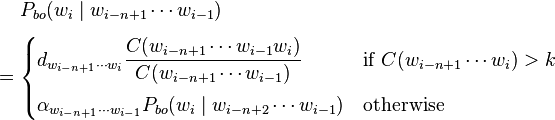

Next Word Prediction
========================================================
author: Christopher Stewart 
date: April 26, 2015

A Natural Language Processing Project

<small>
Capstone Project for Coursera Data Science Specialization
</small>


Predict-A-Word: a Shiny text prediction app
========================================================

### https://cmstewart.shinyapps.io/predict_a_word_backoff/

- Type a sentence, leave out the final word, and select a text type.
- The application suggests a final word.
- Predictions are fast and accurate, thanks to efficient table lookup.


How does it work?
========================================================

* ~.5 GBs of data were cleaned and tokenized to produce words, 2-word sequences ("bigrams"), trigrams and tetragrams.


* Likelihoods were computed and stored in [Markov chains](http://en.wikipedia.org/wiki/Markov_chain) using R's [data tables](http://cran.r-project.org/web/packages/data.table/index.html). 


Algorithm used
========================================================

* 10% of the data was used to evaluate _2 separate models_

> One found the largest match with the highest likelihood score, a version of the [Katz' back-off model](http://en.wikipedia.org/wiki/Katz%27s_back-off_model).



> The second combined the likelihood estimates of all matches and kept the match with the highest combined likelihood in a [linear interpolation](http://en.wikipedia.org/wiki/Linear_interpolation) approach. 

Algorithm used (2)
========================================================

Results showed similar in-sample accuracy rates. Predict-A-Word uses a back-off approach for computational efficiency.


```r
lookup <- function (corpus.type, string) {
  if (corpus.type == "blogs") {lookup.blogs(string)
                               if (exists("tetra.target")) {target <<- tetra.target
                               } else if (exists("tri.target")) {target <<- tri.target
                               } else if (exists("bi.target")) {target <<- bi.target
                               }
                            }
```

[example of server-side function used to accomplish backoff]
